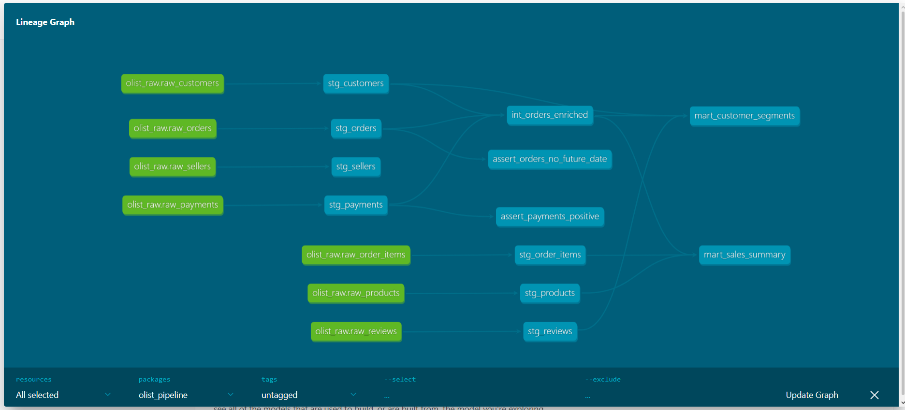
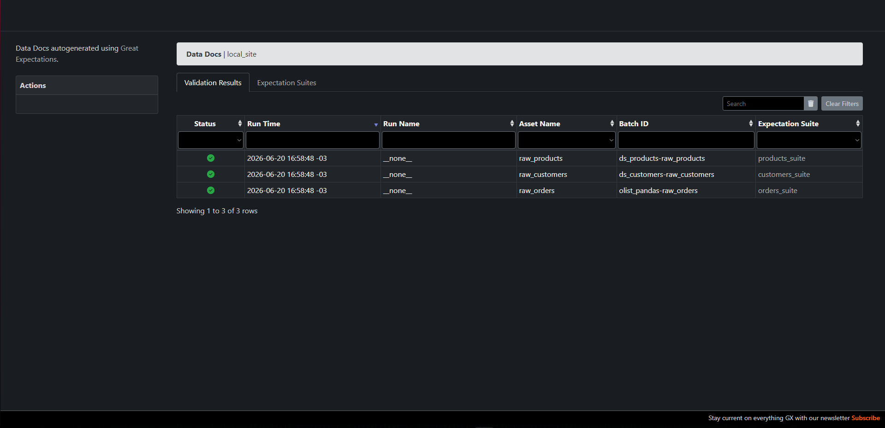

## Dataset

Os dados utilizados são do Kaggle:

https://www.kaggle.com/datasets/olistbr/brazilian-ecommerce

Baixe e coloque em:
data/raw/

## 📊 Insights de Negócio
Usando Python, Pandas e DuckDB, extraímos os seguintes dados da operação da Olist:
1. **Pico de Receita:** O mês com maior faturamento foi novembro de 2017 (2017-11), alcançando a marca de R$ 1.153.528,05.
2. **Top Categorias:** As categorias que mais trazem receita são: Beleza & Saúde, Relógios, Cama/Mesa/Banho, Esportes e Informática.
3. **Satisfação:** A grande maioria dos clientes avalia as compras com nota 5 (exatas 57.328 avaliações).

## 🏗️ Arquitetura de Dados (dbt)

O pipeline de transformação foi construído utilizando **dbt Core** acoplado ao **DuckDB**, seguindo as melhores práticas de modelagem analítica. Atualmente, o projeto conta com as seguintes camadas:

* **Sources (Raw):** Dados brutos extraídos do e-commerce.
* **Staging:** Primeira camada do dbt. Responsável por limpeza de dados sujos (ex: `COALESCE`), tipagem correta de colunas (`CAST`) e padronização de nomenclatura.
* **Intermediate:** Camada de cruzamento e aplicação de regras de negócio simples, preparando o terreno para a camada analítica final.

### Grafo de Linhagem Completo (DAG)

raw_order_items -------->  stg_order_items
raw_payments    -------->  stg_payments
raw_reviews     -------->  stg_reviews
raw_products    -------->  stg_products
raw_sellers     -------->  stg_sellers

## Qualidade de Dados

Validação automatizada com Great Expectations, cobrindo as tabelas `raw_orders`, `raw_customers` e `raw_products`.

## 📊 Insights de Negócio (Storytelling com Dados)

Após a construção das marts analíticas via dbt, extraímos os seguintes comportamentos do dataset da Olist:

1. **Sazonalidade e Pico de Receita:** O mês de maior faturamento histórico foi Novembro de 2017 (R$ 1.010.271,37). Isolando o dia 24/11 (Black Friday), confirmamos a causa: o volume de pedidos nesse único dia (1.176) foi mais de 6x superior à média diária do resto do mês (~188 pedidos/dia) — com ticket médio praticamente estável (R$ 152 vs R$ 159), o que indica que o pico foi puxado por volume de compradores, não por tickets mais caros.
2. **Desafio de Retenção:** Uma taxa alarmante de **96,9%** da base é composta por clientes de "compra única". Apenas 3,1% são recorrentes, indicando um alto Custo de Aquisição de Clientes (CAC) e necessidade de estratégias de fidelização.
3. **Curva ABC de Categorias:** O faturamento é liderado pelos setores de *Beleza & Saúde* (R$ 1.25M), *Relógios & Presentes* (R$ 1.20M) e *Cama, Mesa & Banho* (R$ 1.03M).
4. **Concentração Geográfica:** O eixo Sudeste domina completamente o e-commerce. O estado de São Paulo (SP) sozinho gerou mais de R$ 6 milhões em receita, sendo quase três vezes maior que o segundo colocado (RJ).
5. **Satisfação Polarizada:** A base de clientes possui uma altíssima concentração de notas máximas (54.970 avaliações nota 5), porém a segunda maior concentração de avaliações está no extremo oposto (10.807 notas 1). Os dados atuais não indicam a causa exata dessa insatisfação, mas é uma hipótese comum em e-commerce que esteja associada a problemas logísticos (atraso ou extravio de entrega) — uma investigação com dados de status de entrega poderia confirmar isso.

### Tecnologias

| Ferramenta | Versão | Função |
|---|---|---|
| Python | 3.12.7 | Linguagem principal |
| DuckDB | 1.5.2 | Banco de dados analítico embutido |
| dbt-core | 1.11.8 | Transformação SQL em camadas |
| dbt-duckdb | 1.10.1 | Adapter dbt para DuckDB |
| Great Expectations | 1.18.1 | Validação de qualidade de dados |
| pandas | 3.0.2 | Manipulação de dados em memória |
| Make (GNU Make) | — | Automação de comandos via Makefile |